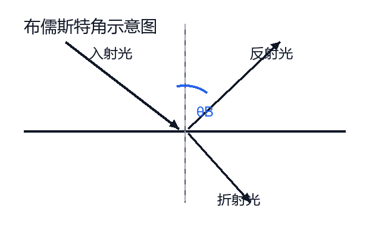
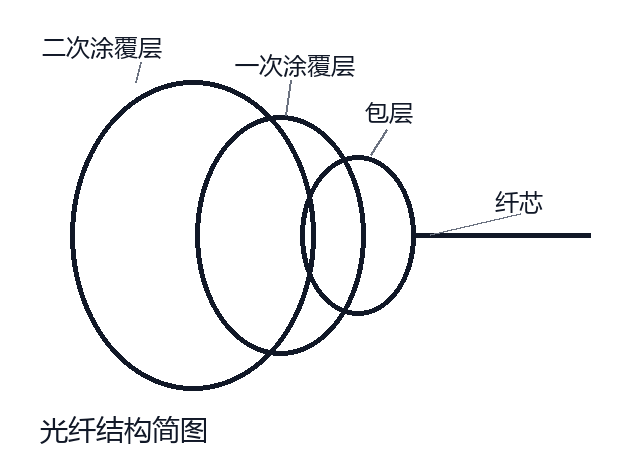

# Optoelectronic Notes｜光电笔记

光电课程笔记整理版，已从原 HTML 讲义转换为适合 GitHub 阅读、复制和检索的 Markdown。内容覆盖光学基础、激光原理、光波导与光纤、光调制等常见考点。

## 目录

- [第二章 光学基础知识](#第二章光学基础知识)
- [第三章 激光原理与激光器](#第三章激光原理与激光器)
- [第四章 光波导与光纤](#第四章光波导与光纤)
- [第五章 光调制](#第五章光调制)

## 使用说明

- 公式保留为纯文本形式，便于在 GitHub、手机端和普通 Markdown 编辑器中查看。
- 两张简图已拆分到 `assets/` 目录，README 中直接引用。
- 章节编号沿用原整理稿，因此当前内容从第 2、3、4、5 章展开。

## 第二章　光学基础知识

c = 1 / √(μ₀ε₀) = 2.998 × 10⁸ m/s

**自然光经过偏振片后**，出射光的振动方向由偏振片透振方向决定，出射光变为线偏振光。

布儒斯特角：tan θ_(B) = n₂ / n₁，此时反射光与折射光互相垂直。

马吕斯定律：入射光场 E₀ 与透振方向成角 φ 时：

I = E₀² cos²φ = I₀ cos²φ

### 偏振光的合成

两束振幅均为 E₀、偏振方向互相垂直、相位差为 π/2 的平面偏振光：

E₁ = E₀ cos(kz − ωt) e_(x)，E₂ = E₀ sin(kz − ωt) e_(y)

E = E₁ + E₂ = E₀[ e_(x)cos(kz − ωt) + e_(y)sin(kz − ωt) ]

合矢量大小不变，端点以角频率 ω 旋转，形成圆偏振光。若两个分量振幅不一致，合矢量端点轨迹为椭圆，形成椭圆偏振光。

### 干涉：条件

两束光要能稳定干涉，应满足：频率相同、振动方向相同、相位相同或相位差恒定。

I = E₀₁² + E₀₂² + 2E₀₁E₀₂ cos(φ₂ − φ₁) = I₁ + I₂ + 2√(I₁I₂) cos(φ₂ − φ₁)

若 E₀₁ = E₀₂ = E：

I = 4E² cos²[(φ₂ − φ₁)/2] = 4I₀ cos²[(φ₂ − φ₁)/2]

#### 干涉相长

Δφ = 2mπ

δ = mλ

m = 0, ±1, ±2, …

#### 干涉相消

Δφ = (2m + 1)π

δ = (2m + 1)λ/2

m = 0, ±1, ±2, …

### 杨氏双缝干涉

单色光照射到距离较近的双缝时，双缝近似为两个相干光源。由于两相干光源到屏幕各点的光程不同，有些位置相长形成明纹，有些位置相消形成暗纹，因此屏幕上形成明暗相间的条纹。

### 迈克尔逊干涉仪

利用分光板把一束光分成两束相互垂直的光，沿不同路径传播，经反射镜反射后再返回并叠加。由于两束光同频同相干，但光程不同，会形成明暗相间的干涉条纹。移动反射镜可以改变光程差，从而观察条纹移动，可用于精确测量光的波长、微小位移或折射率。

自然光：光矢量振动方向完全杂乱，但平均来看各方向均匀。

完全偏振光：光矢量振动方向确定。

部分偏振光：可理解为一部分自然光与一部分偏振光的叠加。

### 高斯光束：内物理量

**z**：传播方向距离。

**r**：横向径向距离。

**w₀**：束腰半径，表示高斯光束最细处的光斑半径。

**w(z)**：光束半径，w(z)=w₀√[1+(z/z₀)²]。

**z₀**：瑞利距离，z₀=πw₀²/λ。

**θ**：发散角，θ≈λ/(πw₀)。束腰越细，发散越大。

**R(z)**：波前曲率半径，R(z)=z[1+(z₀/z)²]。R 越大波前越平，R 越小曲率越明显。

## 第三章　激光原理与激光器

### 爱因斯坦的激光辐射理论

1.  受激吸收：原子原来在低能级 E₁，吸收一束频率合适的光后跃迁到高能级 E₂，满足 hν = E₂ − E₁。
2.  自发辐射：原子处于高能级 E₂ 时，即使没有外来光作用，也可能自发跃迁到低能级 E₁ 并发出一个光子，hν = E₂ − E₁。该过程随机、不相干。
3.  受激辐射：高能级原子在外来光子作用下跃迁到低能级，同时发出一个新光子。新光子与入射光子具有相同的频率、传播方向、相位和偏振状态。

### 激光产生条件

#### 必要条件

1.  **粒子数反转分布：**要求高能级粒子数大于低能级粒子数，即 N₂ > N₁。
2.  **减少无效振动模式：**使受激辐射集中在少数允许模式中，有利于形成方向性强、谱线窄的激光。

#### 充分条件

1.  **阈值条件：**增益必须大于或等于损耗；光在工作物质中被放大的量，应超过在腔内传播时的各种损耗。
2.  **稳定的谐振条件：**由两个相对放置的反射镜构成谐振腔，光在腔内往返传播并获得反馈，只有满足条件的光才能稳定振荡。

**二能级系统不能产生激光：**受激吸收和受激辐射的概率在同一对能级间相同，难以形成稳定的粒子数反转。

**三能级系统：**下能级是基态，基态粒子数很多，因此需要把大量粒子抽运到高能级，阈值较高。

**四能级系统：**激光下能级不是基态，并且能快速弛豫到更低能级，容易形成粒子数反转，阈值较低，常用于连续激光。

### 激光器的组成

**① 激光工作物质**
提供能级结构，是产生受激辐射和光放大的核心。

**② 泵浦源**
向工作物质输入能量，使粒子从低能级跃迁到高能级。

**③ 谐振腔**
提供光反馈、选频和模式选择，使光在腔内多次放大。

### 谐振腔稳定条件

腔长为 L，两镜曲率半径为 R₁, R₂，定义：

g₁ = 1 − L/R₁，g₂ = 1 − L/R₂

若 0 < g₁g₂ < 1，则为稳定腔；否则为非稳定腔。

### 激光特性与常用关系

激光特点：方向性好、单色性好、相干性好、亮度高。普通光源主要靠自发辐射发光，激光主要靠受激辐射。

微分外量子效率：电流每增加一点点，器件向外多输出多少光。常由 P-I 曲线斜率表征：

η_(d) = (qλ / hc) · dP/dI

### 纵模

纵模：光在谐振腔轴线方向形成的不同驻波模式。

**形成原因：**谐振腔只允许满足驻波条件的特定频率光波存在，不满足条件的光不能稳定叠加，会被逐渐削弱。

**纵模频率间隔：**Δν = c / (2nL)。腔长越短，纵模间隔越大，更容易获得单纵模输出。

**纵模数估计：**由激光工作物质的增益谱宽与纵模间隔共同决定，常可理解为“增益谱宽内能容纳多少个纵模”。

模式选择：① 缩短谐振腔长度；② 插入选频元件，如棱镜、滤光片等；③ 利用模式竞争。

单纵模输出：可采用 DFB 或 DBR 结构，通过布拉格选择特定频率，降低不需要模式的增益或增大损耗。

## 第四章　光波导与光纤

波导：限制并引导电磁波、光波传播的结构。

光波导形成条件：芯层折射率必须大于包层折射率，使光在芯层与包层界面满足全反射；光在波导横向往返传播还要满足相位匹配条件。

### 导波场与消逝场

导波场：在光密介质或波导芯层中形成，并沿波导方向传播的场。

特点：沿 z 方向传播，沿横向有场分布；能量主要沿波导方向传输。常把 z 取为波导方向，x 取为垂直界面方向。

消逝场：全反射时，在低折射率介质一侧仍存在一层很薄的光场，沿界面传播，垂直界面方向指数衰减。

特点：沿界面方向传播，垂直界面方向不传输能量；振幅随离开界面的距离迅速衰减，存在范围很小。

### 平面介质波导

一般有 n₁ > n₂, n₃，中间芯层厚度为 d。

#### ① 导模

当光在上下两个界面都满足全反射时，光被限制在波导层 n₁ 中，并沿 z 方向传播。还需满足相位条件：

2k₀n₁d cosθ − 2δ₁₂ − 2δ₁₃ = 2mπ，m = 0,1,2,…

#### ② 衬底辐射模

当 θ_(c13) < θ < θ_(c12) 时，在一个界面满足全反射，在另一个界面不满足全反射。光会逐渐透射进衬底，不能完全限制在波导层中，因此不能形成稳定导波。

#### ③ 包层辐射模

当 θ < θ_(c13) 时，上下两个界面都不满足全反射，光会向上、向下辐射出去。

### 几何光学与物理光学分析波导

**几何光学分析：**把光看成直线，用反射、折射、全反射解释光在波导中的“之字形”传播。特点是直观简单，能说明为什么光被限制在芯层，但不能精确描述主场分布和模式条件。

**物理光学分析：**把光看成电磁波，从波动方程和边界条件出发，分析导波场、消逝场、传播常数和有效折射率。特点是更完整，但数学处理更复杂。

### 光纤结构与参数

典型光纤包括：纤芯、包层、一次涂覆层、二次涂覆层等。芯层折射率记为 n₁，包层折射率记为 n₂。

直径：纤芯直径 2a，包层直径 2b。

数值孔径：NA = n₀ sinψ_(max) = √(n₁² − n₂²)

相对折射率差：Δ = (n₁ − n₂)/n₁

归一化频率：V = (2πa/λ₀)·NA = k₀a√(n₁² − n₂²)

V 表示光纤中可传播横向模式的大致多少。当 V < 2.405 时，只能传输基模；当 V > 2.405 时，可为多模传输。

### 模式数与传输模式

平面波导模式数：m ≤ (1/π)[V − (δ₁₂ + δ₁₃)/2]，其中 V = (2πd/λ₀)√(n₁² − n₂²)。

**单模光纤**
纤芯细，只允许基模传播，模式色散小，适合长距离通信。

**多模光纤**
纤芯粗，耦合容易，但不同模式传播速度不同，容易产生脉冲展宽。

按折射率分布：阶跃型光纤、渐变型光纤。渐变型光纤通过折射率逐渐变化来减小不同模式的时延差。

### 色散

色散定义：不同波长或不同模式的光具有不同传播速度，导致脉冲展宽。

模间色散：不同模式传播速度不同，引起脉冲展宽。

模内色散：实际光源不是绝对单色，不同波长成分传播速度不同。

材料色散：光纤材料折射率 n 随波长 λ 改变而产生的色散。

波导色散：光纤波导结构使有效折射率随波长变化而产生的色散。

## 第五章　光调制

电光调制：利用电场改变介质折射率，实现对光的相位、强度或偏振状态的调制。

声光调制：利用声波在介质中形成折射率周期变化，相当于形成“声光栅”，从而调制或偏转光。

磁光调制：利用磁场改变光的偏振或传播特性。

### 单轴晶体折射率椭球

对于单轴晶体，寻常光 o 光折射率恒为 n₀，波面为球面；非寻常光 e 光折射率为 n_(e)(θ)，与传播方向有关，波面为椭球面，因此传播速度和方向依赖晶体光轴。

### KDP 纵向电光调制

入射光 → 起偏器（// x₁） → KDP 电光晶体 → 1/4 波片 → 检偏器（// x₂） → 出射光

纵向电光调制中，光传播方向与外加电场方向相同。外加电场通过电光效应改变晶体折射率，使两正交偏振分量产生相位延迟，从而实现调制。

半波电压：使两个偏振分量的相位差达到 π 所需的电压。半波电压越小，调制所需驱动电压越低，调制器性能通常越好。

### 弹光、声光与声光衍射

弹光效应：介质受到应力或应变作用后，折射率发生改变的现象。

声光效应：声波在介质中传播时，会产生周期性密度变化，导致折射率变化，形成声光栅。

声光衍射：光通过由声波形成的周期性折射率光栅时发生线性衍射。

### 拉曼-奈斯衍射与布拉格衍射

#### 拉曼-奈斯衍射

声光作用长度短，声频较低，通常会出现多个衍射级。

Q ≪ 1

#### 布拉格衍射

声光作用长度长，声频较高，满足布拉格角时主要只有一个一级衍射光。

Q ≫ 1

> 说明：原手写稿中极少数字迹较小或被压缩的地方，已按光电课程常见表述整理成通顺版本；公式与核心考点尽量保留原意。
